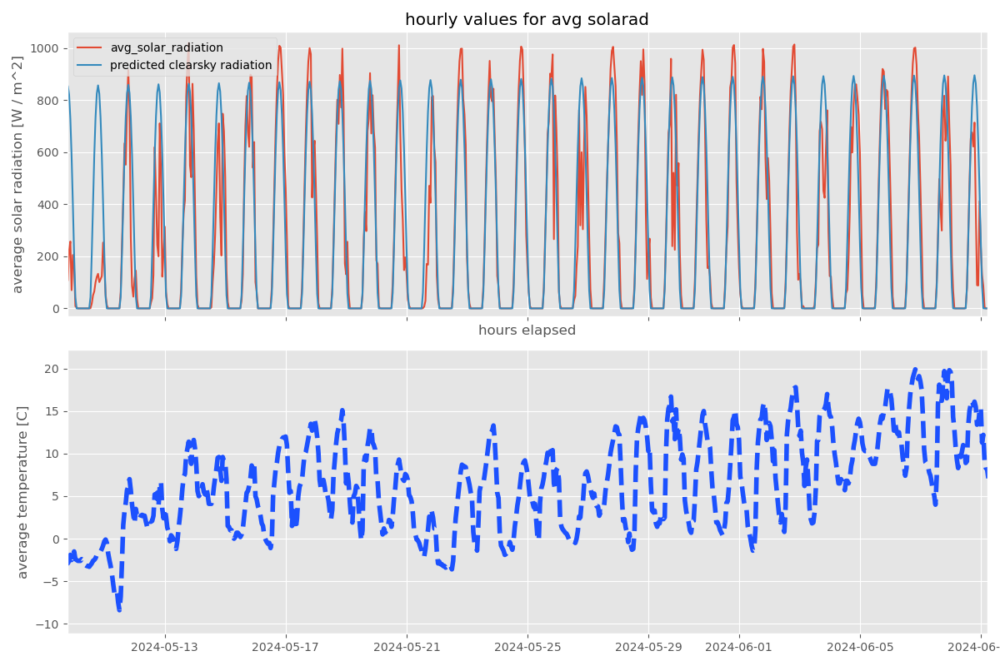

# Solar Radiation Analysis

We examine hourly solar radiation measurements and compare to estimated clear sky radiation, based
on a model of the Earth-Sun system and as a function of measurement station latitude.



## Install and Run

This repo uses the delightful [uv](https://github.com/astral-sh/uv) to manage packages and the
virtual environment.
To get started, follow that link to install `uv`, check out this repo locally, then use `uv venv`
to create the virtual environment with the necessary packages.
Run `source .venv/bin/activate` to activate the virtual environment, and then run

```bash
python3 ./weather_analysis.py
```

to run the script.
